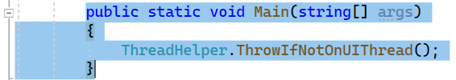
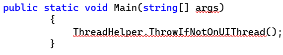
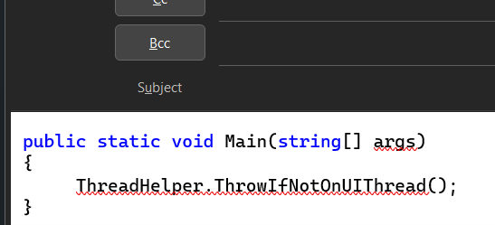
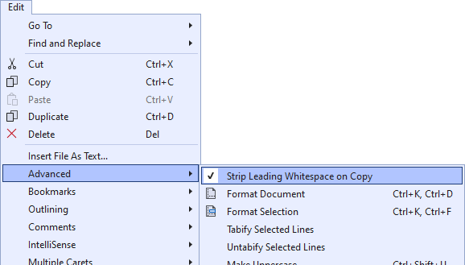

[marketplace]: https://marketplace.visualstudio.com/items?itemName=MadsKristensen.CopyNice
[vsixgallery]: http://vsixgallery.com/extension/CopyNice.1f9c7576-432f-484b-bfd1-4ce7f6f4ccf4/
[repo]:https://github.com/madskristensen/CopyNice

# Copy Nice for Visual Studio

Download this extension from the [Visual Studio Marketplace][marketplace]
or get the [CI build][vsixgallery].

--------------------------------------

You want to share some code you’ve written with a colleague, so you select it in the editor and hit **Ctrl+C** to copy it. As you paste it in Outlook, you realize that the indentation levels are inconsistent due to your original selection. You must now either go back to Visual Studio and do a box selection  and copy that, or manually fix the indentation issue in Outlook. You know this, yet you make this mistake almost every time. Sounds familiar?

It usually happens because you start your selection without the leading indentation. But every subsequent line has it. The result looks something like this when you paste it into Outlook:

With this extension, when code is copied it will automatically be formatted to take care of the leading indentation issue.. 

The result when pasting into Outlook looks like this:

For Visual Studio to correctly identify when to strip indentation, these conditions must all be true:

1.	Selection mode is not Box Selection
2.	User selected multiple lines
3.	Selection must start on an empty indentation

This makes sure that what you copy is always what you expect. But in case you want to disable this feature, you can of course do that from the **Edit -> Advanced -> Strip Leading Whitespace on Copy** command.

## How can I help?
If you enjoy using the extension, please give it a ★★★★★ rating on the [Visual Studio Marketplace][marketplace].

Should you encounter bugs or if you have feature requests, head on over to the [GitHub repo][repo] to open an issue if one doesn't already exist.

Pull requests are also very welcome, since I can't always get around to fixing all bugs myself. This is a personal passion project, so my time is limited.

Another way to help out is to [sponsor me on GitHub](https://github.com/sponsors/madskristensen).
